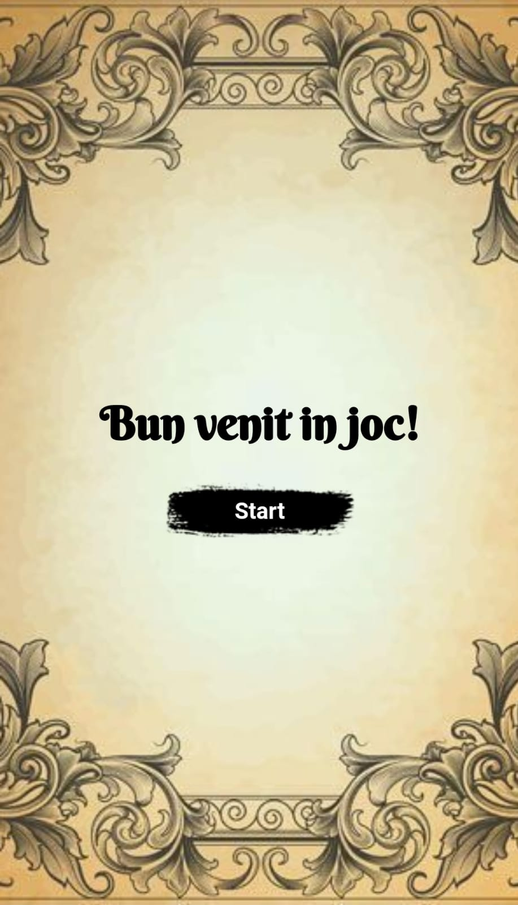
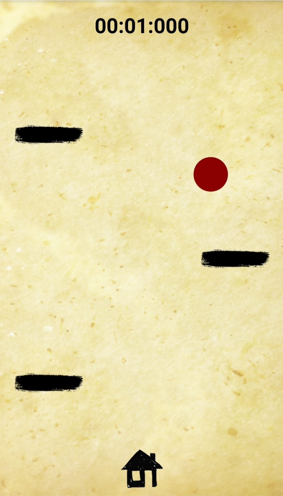
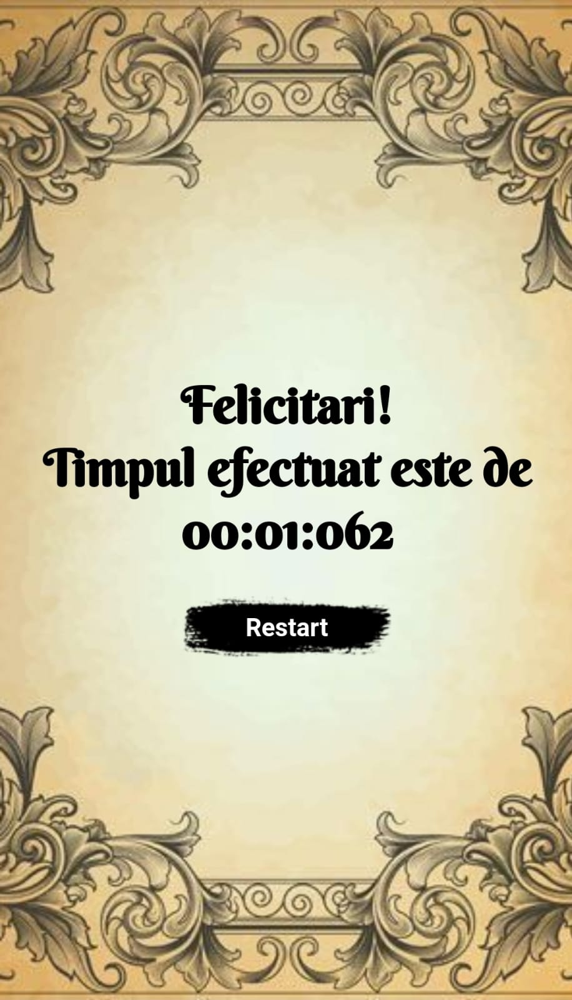

# BallRace - Proiect DAM.

Jocul 'BallRace' este o aplicatie mobila scrisa in JavaScript si reprezinta proiectul final la materia 'Dezvoltarea Aplicatiilor Mobile'.
Misiunea jocului este de a conduce bila, evitand obstacolele, pana la destinatie. Directia bilei este controlata prin miscarea telefonului.

Adrenalina jocului este evidentiata prin obtinerea unui timp cat mai bun.

Acest proiect a fost realizat de catre Fülöp Bettina-Elena si Cristea Ioan.

